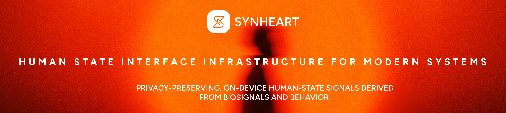

<!-- Centered hero section -->
<div align="center">



Beep Boop.

**Make Computers Feel Human**  

[](https://synheart.ai)
[](#license)
[](#contributing)

</div>

---

## 🌍 What is Synheart?

**Synheart** is an open, privacy-preserving **Human State Interface (HSI) infrastructure** that enables software systems to understand human emotional, cognitive, and behavioral state — without relying on explicit user input.

Instead of clicks, prompts, or surveys, Synheart derives **human state from biosignals and digital behavior**, processed locally and represented in a standardized format.

At the core of Synheart is **HSI 1.0** — a **canonical, language-agnostic JSON contract** for representing human state across independent systems.

> HSI plays a role similar to GPS or HTTP — a shared communication standard for human state.

---

## 🧠 Human State Modules

Synheart provides modular interpreters that emit **HSI 1.0-compliant outputs**:

- **Synheart Emotion**  
  Interprets emotional dynamics such as stress, calm, and arousal from physiological signals.

- **Synheart Focus**  
  Models cognitive engagement, attention stability, and mental load over time.

- **Synheart Behavior**  
  Captures behavioral patterns derived from interaction and usage dynamics.

All modules are **composable, interoperable, and optional** — systems can adopt only what they need.

---

## 🧩 Architecture Overview

```text
[ Wearables & Devices ]
Apple Watch • Pixel Watch • Sensors
↓
Synheart Wear (vendor-agnostic signal access)
↓
Human State Modules (Emotion • Focus • Behavior)
↓
HSI 1.0 (canonical human-state JSON)
↓
Your System (AI • Interfaces • Agents • Apps)
```


## ⚙️ Core Components

| Component | Description |
| --- | --- |
| 🧠 **HSI 1.0** | The authoritative human-state interface specification |
| 🫀 **Synheart Wear** | Vendor-agnostic library for reading biosignals from wearables |
| 🧩 **State Modules** | Emotion, Focus, and Behavior interpreters |
| 📦 **SDKs** | Platform SDKs for on-device integration |
| 📄 **Whitepapers** | Open research and technical documentation |

---

## 🔐 Privacy by Design

- **On-device processing by default**
- **No raw biosignals required to leave the device**
- **Derived state only (HSI outputs)**
- **Consent-gated cloud sync (optional)**

Synheart is built to support **ethical, human-centered computing** from the ground up.

## 🚀 Tech stacks

### These are us and our AI agents play around :) 

- Rust (engine & core runtime)
- Flutter
- Kotlin
- Swift
- Go
- Python
- TS

More SDK-specific setup is available in each package’s README and in `docs/`.


---


## 💡 Why Synheart?

- 🧠 Standardized human state — not ad-hoc emotion labels
- 🔐 Privacy-preserving by default
- 🧩 Modular and extensible
- 🌍 Vendor- and platform-agnostic
- 📄 Open source with open research

Synheart is not an app, model, or agent.

It is infrastructure for human-state-aware systems.

---

## 🗺️ Roadmap

- Expanded HSI schema (v1.x)
- Additional state interpreters
- On-device kernels
- Reference integrations
- Research benchmarks

---

## 🤝 Contributing

Synheart is **source-available** — the code is published for you to read, audit, and learn from, but development happens in-house.

- ✅ **Issues welcome** — bug reports, questions, and feature requests via GitHub Issues on the relevant repository
- ❌ **Pull requests are not accepted** at this time

See `REPOSITORY_IMPLEMENTATION_GUIDELINES.md` for repo conventions.

---

## 🔒 License

Licensed under the Apache 2.0 License.
© 2025–2026 Synheart AI.

---

<div align="center">

🫶 "Human state is a first-class signal."

🌐 [synheart.ai](https://synheart.ai) • [LinkedIn](https://www.linkedin.com/company/synheart/) • [X](https://x.com/synheart_ai)

</div>